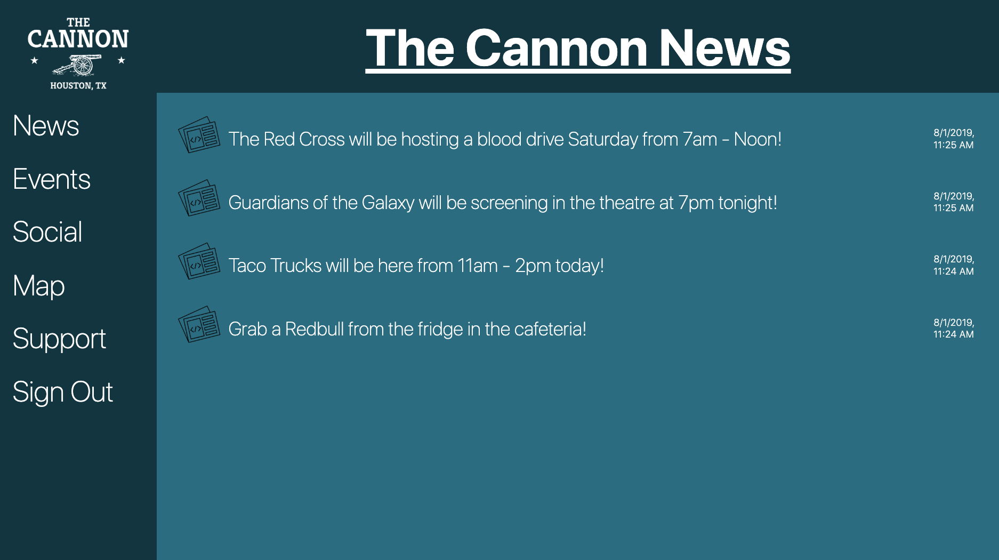

# Slack for The Cannon
> A Solution for Socialization in the Workspace

[Live Website!](https://cannon-slack.firebaseapp.com/index.html)

## Languages and Services

__This Web Application uses [Google Firebase](https://firebase.google.com/)'s [Realtime Database](https://firebase.google.com/docs/database), [Authentication](https://firebase.google.com/docs/auth) and [Hosting](https://firebase.google.com/docs/hosting) services. The application was build with [HTML5](https://developer.mozilla.org/en-US/docs/Web/Guide/HTML/HTML5), [CSS3](https://developer.mozilla.org/en-US/docs/Archive/CSS3#Modules_and_the_standardization_process) and Vanilla [JavaScript](https://developer.mozilla.org/en-US/docs/Web/JavaScript).__

### Why We Made This

Coworking Spaces are all the rage in the Business World right now. Many of them market the social aspects and fun gimmicks of food, beverages, slides, comfortable seating, meeting rooms, ping-pong tables and more! However, many of the clients in these coworking spaces are not interacting with each other. They are not fully taking advantage of the community around them.

This is where we come in! We have a team filled with people that love to socialize, and we wanted to find a way to solve this problem for our current workspace.

We have created a simple communication platform for members of the community designed in a way to promote socialization between each other.

## Features
The website is responsively designed, mobile friendly and has several features for administrators to access.

__Log In__ - Using [Firebase's Authentication](https://firebase.google.com/docs/auth) service we allow members to log-in/sign-in via a google account or an email.

__Navigation Bar__ - We have included six links on the left side of the application that navigates to pages that have different functions listed below. (__Mobile__): The menu collapses and has a swipe function to slide out and back in, or a toggle function in the top menu bar.

__News__ - Administrators can post updates about what's going on in the community to this page. The features are restricted based on the member identification from the [Firebase Authentication](https://firebase.google.com/docs/auth). The news updates are updated immediately through the [Firebase Realtime Database](https://firebase.google.com/docs/database).
* _Parking is closed in the front today, please use the back entrance!_
* _DigitalCrafts brought tacos for lunch today, come get some in the lounge!_

__Events__ - Administrators can post events that are hosted at the coworking space to spread awareness to the members of the community what availabilities there are after hours. The features are restricted based on the member identification from the [Firebase Authentication](https://firebase.google.com/docs/auth). The events are updated immediately through the [Firebase Realtime Database](https://firebase.google.com/docs/database).

__UiPath Hackathon__
_Saturday 9:00am - Sunday 5:00pm
Register on eventbrite at [here!](https://www.eventbrite.com/e/rpa-league-texas-2019-hackathon-and-job-fair-tickets-65852987057?aff=ebdssbdestsearch)_

__Social__ - Anyone who has logged into the web application can interact with this chatting platform. The display name and picture are taking from the email or google account that the member has provided. The messages are updated immediately through the [Firebase Realtime Database](https://firebase.google.com/docs/database).

__Map__ - This page has a map of the location for the community to have an easy reference to see which rooms are hosting which events. (__Mobile__): The images become links to a pdf file allowing the members to pinch and spread the image out.

__Support__ - The page has a form for members to submit feedback or address issues with the administration. The name and email are pulled from the [Firebase Authentication](https://firebase.google.com/docs/auth) and propagated into the fields for the member. The submit button sends the message via JavaScript SMTP to the administrator's email.

__Sign Out__ - Members can sign out from their [Firebase Authenticated](https://firebase.google.com/docs/auth) account.

## Release History
* 0.1.0 - August 2nd
    * First Release via Firebase Hosting
    * JavaScript SMTP not live
    * Notifications not live
* 0.0.1 - July 29th
    * Work in Progress

## Creators

Jacob Bankston - [LinkedIn](https://www.linkedin.com/in/jacob-bankston-85534195/) - [Twitter](https://twitter.com/_JacobBankston) - [Medium](https://medium.com/@_JacobBankston) - [GitHub](https://github.com/Jacob-Bankston) - [Email](jacob.bankston.smile@gmail.com)

Joshua Fitzgerald - [LinkedIn](https://www.linkedin.com/in/fitz6/) - [GitHub](https://github.com/yourfriendfitz)

Nickolas Fuentes - [LinkedIn](http://linkedin.com/in/nickolasfuentes) - [GitHub](https://github.com/nickfuentes)

Antonio Tobar - [Linkedin](https://www.linkedin.com/in/antonio-tobar-dev/) - [GitHub](https://github.com/TonyTcode) - [Email](antonio.tobar.dev@gmail.com)
